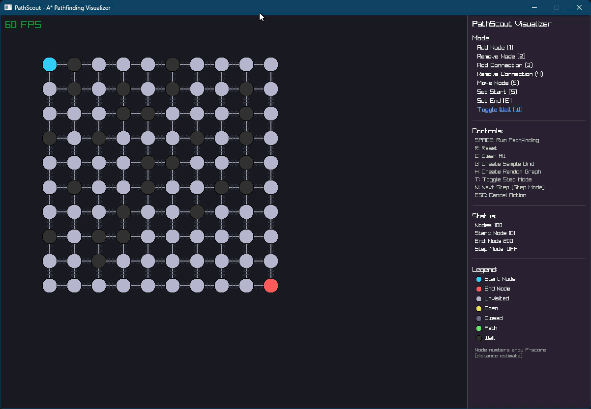
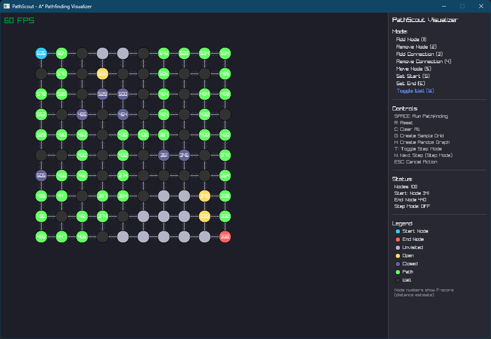

# PathScout - Interactive Pathfinding Visualizer

A complete A* pathfinding implementation with real-time visualization using Raylib.

## Screenshots


*Real-time A* pathfinding visualization with step-by-step exploration*


*Interactive graph builder with multiple editing modes*

## Project Structure

```
PathScout/
├── PathScout.Core/          # Core pathfinding logic
│   ├── Algorithms/
│   │   ├── AStarPathfinder.cs      # A* implementation
│   │   ├── DijkstrasAlgorithm.cs   # Placeholder for Dijkstra's
│   │   └── IPathfinder.cs          # Algorithm interface
│   ├── Structure/
│   │   └── PathNode.cs             # Node data structure
│   ├── Enums/
│   │   ├── NodeState.cs            # Node states (Unvisited, Open, Closed, etc.)
│   │   └── AlgorithmType.cs        # Algorithm selection
│   └── PathScout.cs                # Main API facade
│
├── PathScout.View/          # Interactive visualization
│   ├── PathfindingVisualizer.cs    # UI state management
│   ├── Renderer.cs                 # Raylib rendering
│   ├── Program.cs                  # Main entry point
│   └── README.md                   # View documentation
│
└── PathScout.Tests/         # Comprehensive test suite
    ├── Structure/
    │   └── PathNodeTests.cs        # Node tests (17 tests)
    ├── Core/
    │   └── PathScoutTests.cs       # Core API tests (16 tests)
    ├── Algorithms/
    │   └── AStarPathfinderTests.cs # A* tests (10 tests)
    ├── Integration/
    │   └── PathfindingIntegrationTests.cs # E2E tests (9 tests)
    └── README.md                   # Test documentation
```

## Features

### Core Library (PathScout.Core)
- **A* Pathfinding** with squared Euclidean distance for ~40% performance boost
- **Dictionary-based node management** for O(1) lookups
- **Pre-calculated edge weights** for optimal performance
- **Async/await support** with step-by-step callbacks
- **Cancellation token support**
- **Wall/obstacle support**
- **Bidirectional connections** with auto-cleanup

### Interactive Visualization (PathScout.View)
- **Real-time algorithm animation** - Watch nodes being explored
- **Instant solve mode** - Get results immediately without animation
- **Animated mode** - 50ms delays for clear step visualization
- **Full mouse interaction** - Click to add/remove nodes and connections
- **Drag-to-move nodes** - Reposition nodes with automatic distance recalculation
- **Keyboard shortcuts** - Quick mode switching (1-5 keys)
- **Step-by-step mode** - Manually advance through each iteration
- **Random graph generation** - Create organic, non-grid layouts
- **Grid generation** - Quick structured graph creation
- **Maze generation** - Automatically create obstacles for challenging pathfinding
- **Color-coded visualization**:
  - Green: Start/End nodes and final path
  - Yellow: Open nodes (being considered)
  - Blue: Closed nodes (already evaluated)
  - Black: Walls (obstacles)
  - Gray: Unvisited nodes
- **Live statistics** - Node count, current mode, pathfinding status
- **Sample grid generator** - Quick testing setup

### Test Suite (PathScout.Tests)
- **48 comprehensive tests** across all components
- **Unit tests** for PathNode, PathScout API
- **Algorithm tests** for A* correctness and optimality
- **Integration tests** for complete workflows
- **Performance tests** for large graphs (400 nodes)
- **Edge case coverage** - Disconnected graphs, walls, no-path scenarios

## Quick Start

### 1. Clone and Build
```bash
git clone <your-repo>
cd PathScout
dotnet build
```

### 2. Run Tests
```bash
dotnet test PathScout.Tests
```

### 3. Run Visualizer
```bash
cd PathScout.View
dotnet run
```

Or press **F5** in Visual Studio with `PathScout.View` as startup project.

### 4. Basic Usage
1. Press **G** to generate a sample 20x20 grid (or **H** for random graph)
2. Press **M** to generate a maze with obstacles
3. Press **5** to enter Move Node mode and drag nodes around
4. Press **SPACE** to run pathfinding and watch the algorithm navigate the maze!

## Usage Guide

### Using the Core Library

```csharp
using PathScout.Core;
using PathScout.Core.Enums;

// Create pathfinder
var pathScout = new PathScout(AlgorithmType.AStar);

// Build graph
var node1 = pathScout.AddNode(0, 0);
var node2 = pathScout.AddNode(10, 0);
var node3 = pathScout.AddNode(20, 0);

pathScout.AddConnection(node1.NodeId, node2.NodeId);
pathScout.AddConnection(node2.NodeId, node3.NodeId);

// Find path
var path = await pathScout.FindPath(node1.NodeId, node3.NodeId);

// With visualization callback
var path = await pathScout.FindPath(
    node1.NodeId, 
    node3.NodeId,
    async () =>
    {
        // Called after each step
        RenderCurrentState();
        await Task.Delay(50);
    });
```

### Visualizer Controls

#### Mode Selection (1-5)
- `1` - Add Node
- `2` - Remove Node
- `3` - Add Connection (click two nodes)
- `4` - Remove Connection (click two nodes)
- `S` - Set Start Node
- `E` - Set End Node
- `W` - Toggle Wall

#### Actions
- `SPACE` - Run pathfinding
- `R` - Reset pathfinding state
- `C` - Clear entire graph
- `G` - Generate 20x20 sample grid
- `M` - Generate maze (30% walls)
- `T` - Toggle visualization mode (Instant/Animated/Step-by-Step)
- `N` - Next step (in Step-by-Step mode)
- `ESC` - Cancel current action

## Key Algorithms & Optimizations

### A* Implementation
```csharp
F(n) = G(n) + H(n)
```
- **G(n)**: Actual cost from start to node n
- **H(n)**: Heuristic estimated cost from n to goal
- **F(n)**: Total estimated cost

### Performance Optimizations
1. **Squared Distance** - Avoid expensive `sqrt()` operations
   ```csharp
   DistanceSquared = (x2-x1)² + (y2-y1)²  // ~40% faster
   ```

2. **Pre-calculated Edge Weights** - Computed once during connection
   ```csharp
   _connections.Add(node, Vector2.DistanceSquared(pos1, pos2));
   ```

3. **Dictionary Lookups** - O(1) node access instead of O(n)
   ```csharp
   _nodeMap.GetValueOrDefault(nodeId);  // Fast!
   ```

4. **Open Set Tracking** - Prevent duplicate priority queue entries
   ```csharp
   if (!openSet.Contains(neighbor))
       openQueue.Enqueue(neighbor, neighbor.FScore);
   ```

5. **Stale Entry Skipping** - Handle re-enqueued nodes efficiently
   ```csharp
   if (closedList.Contains(current)) continue;
   ```

## Performance Metrics

From integration tests:
- **Small graphs** (3-9 nodes): < 1ms
- **Medium graphs** (100 nodes): < 10ms
- **Large graphs** (400 nodes, 760 connections): < 50ms
- **Visualization**: 60 FPS rendering

## Testing

Run all tests:
```bash
dotnet test
```

Run specific test class:
```bash
dotnet test --filter "FullyQualifiedName~AStarPathfinderTests"
```

With detailed output:
```bash
dotnet test --verbosity detailed
```

### Test Coverage
- **PathNode** - Construction, connections, validation, reset
- **PathScout** - CRUD operations, graph management, pathfinding
- **A* Algorithm** - Correctness, optimality, wall avoidance, edge cases
- **Integration** - Complete workflows, large graphs, dynamic modification

## Architecture Decisions

### Why Squared Distance?
- **Faster**: Eliminates `sqrt()` calls (~40% speedup)
- **More Precise**: Avoids floating-point rounding errors
- **Still Optimal**: Maintains A* admissibility
- **Trade-off**: Path costs in squared units (not human-readable)

### Why Dictionary for Nodes?
- **O(1) lookups** vs O(n) with `FirstOrDefault()`
- Critical for large graphs with frequent node access
- Minimal memory overhead

### Why Raylib?
- **Simple API** - Easy to learn, fast to implement
- **High Performance** - Hardware accelerated, 60 FPS
- **Cross-platform** - Windows, Linux, macOS
- **Perfect for visualization** - Direct rendering, no UI framework complexity

### Async/Await Architecture
- **Non-blocking UI** - Pathfinding doesn't freeze rendering
- **Step-by-step support** - Natural fit for visualization callbacks
- **Cancellation** - Can interrupt long-running operations

## Future Enhancements

Potential additions:
- [ ] **Dijkstra's Algorithm** - Complete the placeholder implementation
- [ ] **Weighted edges** - Visual display of edge costs
- [ ] **Export/Import** - Save and load graph layouts
- [ ] **Diagonal connections** - 8-directional movement
- [ ] **Algorithm comparison** - Side-by-side A* vs Dijkstra
- [ ] **Performance profiler** - Built-in metrics display
- [ ] **Undo/Redo** - Graph modification history
- [ ] **Custom heuristics** - Manhattan, Diagonal distance options

## Learn More

### Files to Study
1. **PathScout.Core/Algorithms/AStarPathfinder.cs** - Core A* implementation
2. **PathScout.Core/Structure/PathNode.cs** - Node structure with optimizations
3. **PathScout.View/PathfindingVisualizer.cs** - UI state management
4. **PathScout.Tests/** - Comprehensive examples of usage

### Key Concepts
- **A* Algorithm**: Informed search using heuristics
- **Priority Queue**: Efficiently finds lowest F-score
- **Squared Distance**: Optimization while maintaining correctness
- **Open/Closed Lists**: Tracking explored vs frontier nodes
- **Admissible Heuristic**: Never overestimates, guarantees optimal path

## Troubleshooting

**Build fails:**
```bash
dotnet restore
dotnet clean
dotnet build
```

**Tests fail:**
- Check that PathNode properties have public setters
- Verify squared distance is used consistently

**Visualizer doesn't start:**
- Ensure Raylib-cs package is restored
- Check .NET 10 SDK is installed
- Try `dotnet run` from PathScout.View directory

**Pathfinding doesn't run:**
- Set start (green) and end (red) nodes
- Ensure nodes are connected (visible lines)
- Check no previous pathfinding is running

## License

[Your License Here]

## Contributing

[Contribution Guidelines]

---

Built with C# 14, .NET 10, and Raylib
